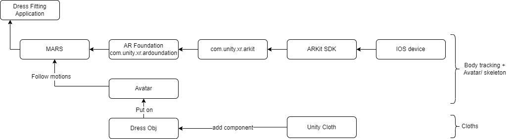

# AR-Dress-Fitting
Dress Fitting è un'applicazione, per il sistema operativo IOS, che permette all'utente di indossare virtualmente dei vestiti tramite l'utilizzo della realtà aumentata.
All'interno dell'applicazione, viene generato un avatar il quale indosserà i vestiti. Inoltre, l'avatar seguirà tutti i movimenti dell'utente.  
L'utente ha la possibilità di:
* Modificare le dimensioni dell'avatar
* Selezionare un outfit
* Selezionare la taglia dei vestiti
* Visualizzare/ nascondere l'avatar
* Cambiare il colore dei vestiti
* Togliere l'outfit "indossato"

## Tecnologie utilizzate
Le tecnologie utilizzate per la realizzazione di tale progetto sono:
* [Unity](https://unity.com/) : 2019.4.40
* [MARS](https://docs.unity3d.com/Packages/com.unity.mars@1.4/manual/index.html) : 1.4.1
* [C#](https://learn.microsoft.com/it-it/dotnet/csharp/)

## Architettura

